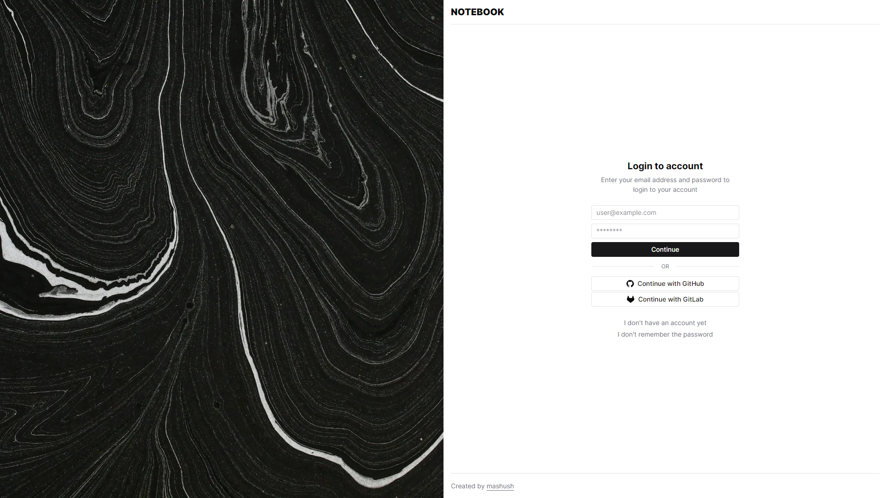
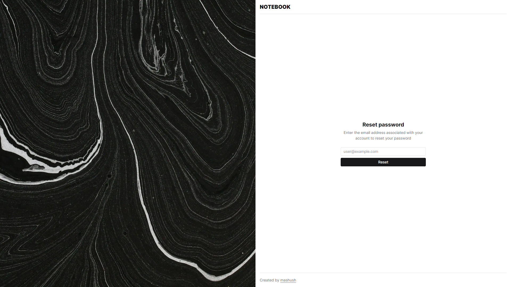
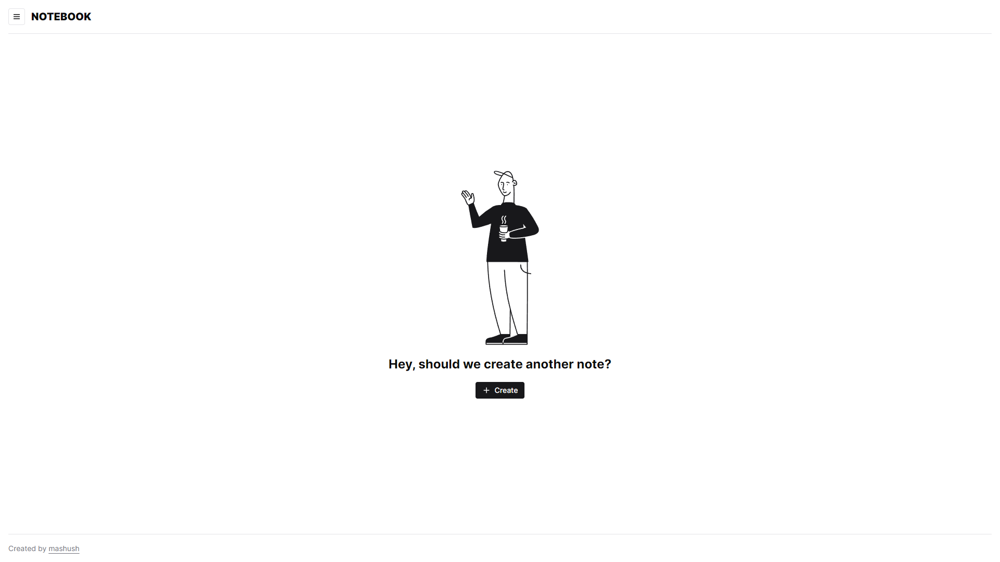
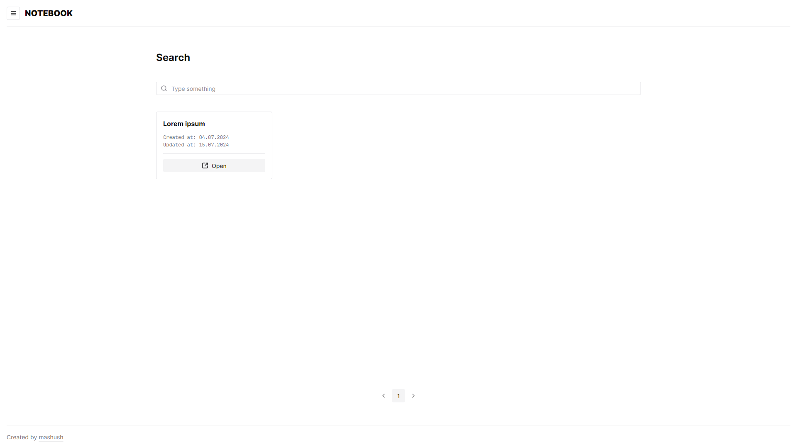
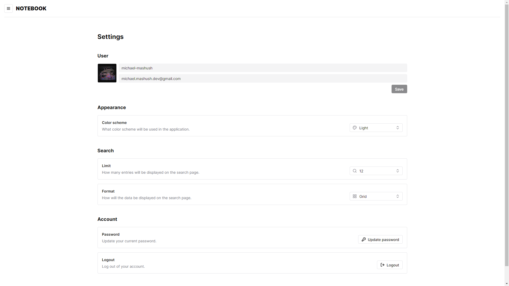
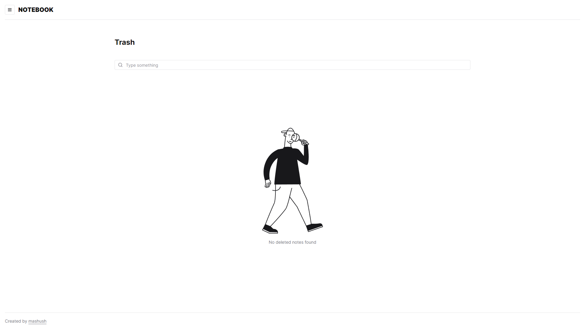
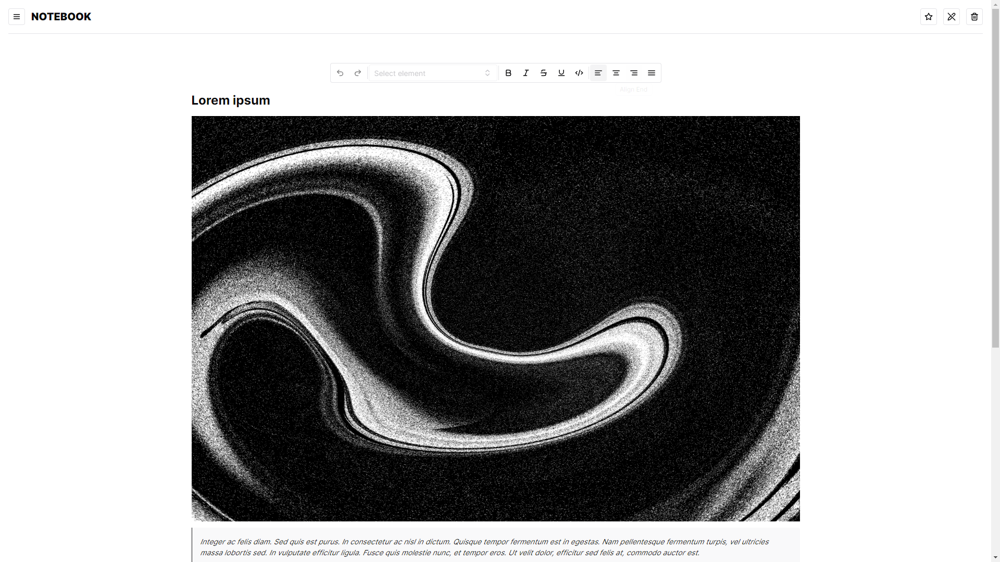
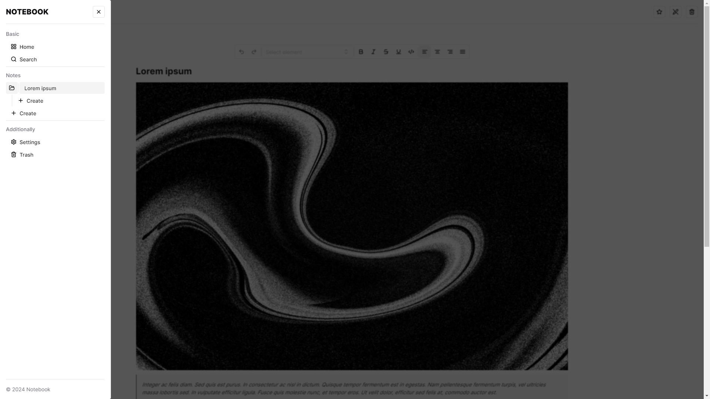
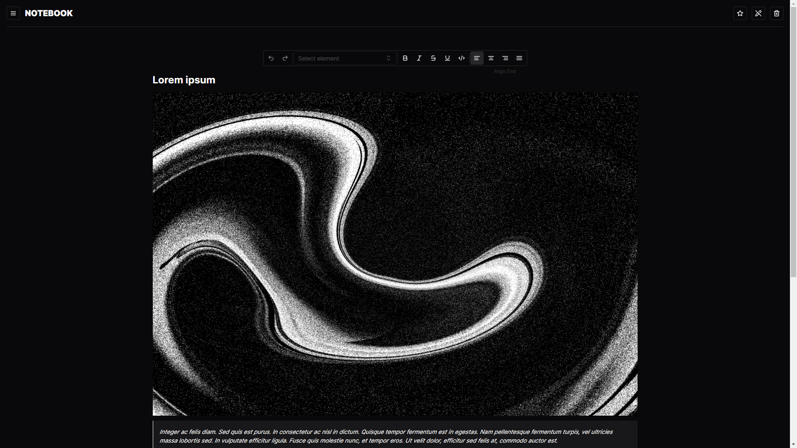

<h1>
  Notebook
</h1>

  This is a simple yet powerful application for creating personal notes that offers extensive formatting capabilities. I strived to make the process of creating and organizing notes as convenient and efficient as possible, without any unnecessary clutter. In developing the application, I was greatly inspired by the <a href="https://ui.shadcn.com/">shadcn/ui</a> components, from which I adopted some of the styles.

<h2>
  Technology stack
</h2>

  <picture>
     <source srcset="https://img.shields.io/badge/html-%23222222.svg?style=for-the-badge&logo=html5&logoColor=E34F26" media="(prefers-color-scheme: dark)" />
     <source srcset="https://img.shields.io/badge/html-%23F5F5F5.svg?style=for-the-badge&logo=html5&logoColor=E34F26" media="(prefers-color-scheme: light)" />
     
  </picture>
  <picture>
     <source srcset="https://img.shields.io/badge/css-%23222222.svg?style=for-the-badge&logo=css3&logoColor=1572B6" media="(prefers-color-scheme: dark)" />
     <source srcset="https://img.shields.io/badge/css-%23F5F5F5.svg?style=for-the-badge&logo=css3&logoColor=1572B6" media="(prefers-color-scheme: light)" />
     
  </picture>
  <picture>
     <source srcset="https://img.shields.io/badge/sass-%23222222.svg?style=for-the-badge&logo=sass&logoColor=CC6699" media="(prefers-color-scheme: dark)" />
     <source srcset="https://img.shields.io/badge/sass-%23F5F5F5.svg?style=for-the-badge&logo=sass&logoColor=CC6699" media="(prefers-color-scheme: light)" />
     
  </picture>
  <picture>
     <source srcset="https://img.shields.io/badge/bem-%23222222.svg?style=for-the-badge&logo=bem&logoColor=FFFFFF" media="(prefers-color-scheme: dark)" />
     <source srcset="https://img.shields.io/badge/bem-%23F5F5F5.svg?style=for-the-badge&logo=bem&logoColor=000000" media="(prefers-color-scheme: light)" />
     
  </picture>
  <picture>
     <source srcset="https://img.shields.io/badge/javascript-%23222222.svg?style=for-the-badge&logo=javascript&logoColor=F7DF1E" media="(prefers-color-scheme: dark)" />
     <source srcset="https://img.shields.io/badge/javascript-%23F5F5F5.svg?style=for-the-badge&logo=javascript&logoColor=F7DF1E" media="(prefers-color-scheme: light)" />
     
  </picture>
  <picture>
     <source srcset="https://img.shields.io/badge/typescript-%23222222.svg?style=for-the-badge&logo=typescript&logoColor=3178C6" media="(prefers-color-scheme: dark)" />
     <source srcset="https://img.shields.io/badge/typescript-%23F5F5F5.svg?style=for-the-badge&logo=typescript&logoColor=3178C6" media="(prefers-color-scheme: light)" />
     
  </picture>

  <picture>
     <source srcset="https://img.shields.io/badge/react-%23222222.svg?style=for-the-badge&logo=react&logoColor=61DAFB" media="(prefers-color-scheme: dark)" />
     <source srcset="https://img.shields.io/badge/react-%23F5F5F5.svg?style=for-the-badge&logo=react&logoColor=61DAFB" media="(prefers-color-scheme: light)" />
     
  </picture>
  <picture>
     <source srcset="https://img.shields.io/badge/zustand-%23222222.svg?style=for-the-badge&logo=react&logoColor=FFB330" media="(prefers-color-scheme: dark)" />
     <source srcset="https://img.shields.io/badge/zustand-%23F5F5F5.svg?style=for-the-badge&logo=react&logoColor=FFB330" media="(prefers-color-scheme: light)" />
     
  </picture>
  <picture>
     <source srcset="https://img.shields.io/badge/react%20router-%23222222.svg?style=for-the-badge&logo=react-router&logoColor=CA4245" media="(prefers-color-scheme: dark)" />
     <source srcset="https://img.shields.io/badge/react%20router-%23F5F5F5.svg?style=for-the-badge&logo=react-router&logoColor=CA4245" media="(prefers-color-scheme: light)" />
     
  </picture>
  <picture>
     <source srcset="https://img.shields.io/badge/react%20query-%23222222.svg?style=for-the-badge&logo=react-query&logoColor=FF4154" media="(prefers-color-scheme: dark)" />
     <source srcset="https://img.shields.io/badge/tanstack%20react%20query-%23F5F5F5.svg?style=for-the-badge&logo=react-query&logoColor=FF4154" media="(prefers-color-scheme: light)" />
     
  </picture>
  <picture>
     <source srcset="https://img.shields.io/badge/react%20hook%20form-%23222222.svg?style=for-the-badge&logo=react-hook-form&logoColor=EC5990" media="(prefers-color-scheme: dark)" />
     <source srcset="https://img.shields.io/badge/react%20hook%20form-%23F5F5F5.svg?style=for-the-badge&logo=react-hook-form&logoColor=EC5990" media="(prefers-color-scheme: light)" />
     
  </picture>
  <picture>
     <source srcset="https://img.shields.io/badge/framer%20motion-%23222222.svg?style=for-the-badge&logo=framer&logoColor=0055FF" media="(prefers-color-scheme: dark)" />
     <source srcset="https://img.shields.io/badge/framer%20motion-%23F5F5F5.svg?style=for-the-badge&logo=framer&logoColor=0055FF" media="(prefers-color-scheme: light)" />
     
  </picture>

  <picture>
     <source srcset="https://img.shields.io/badge/vite-%23222222.svg?style=for-the-badge&logo=vite&logoColor=646CFF" media="(prefers-color-scheme: dark)" />
     <source srcset="https://img.shields.io/badge/vite-%23F5F5F5.svg?style=for-the-badge&logo=vite&logoColor=646CFF" media="(prefers-color-scheme: light)" />
     
  </picture>
  <picture>
     <source srcset="https://img.shields.io/badge/vitest-%23222222.svg?style=for-the-badge&logo=vitest&logoColor=6E9F18" media="(prefers-color-scheme: dark)" />
     <source srcset="https://img.shields.io/badge/vitest-%23F5F5F5.svg?style=for-the-badge&logo=vitest&logoColor=6E9F18" media="(prefers-color-scheme: light)" />
     
  </picture>
  <picture>
     <source srcset="https://img.shields.io/badge/eslint-%23222222.svg?style=for-the-badge&logo=eslint&logoColor=4B32C3" media="(prefers-color-scheme: dark)" />
     <source srcset="https://img.shields.io/badge/eslint-%23F5F5F5.svg?style=for-the-badge&logo=eslint&logoColor=4B32C3" media="(prefers-color-scheme: light)" />
     
  </picture>
  <picture>
     <source srcset="https://img.shields.io/badge/stylelint-%23222222.svg?style=for-the-badge&logo=stylelint&logoColor=FFFFFF" media="(prefers-color-scheme: dark)" />
     <source srcset="https://img.shields.io/badge/stylelint-%23F5F5F5.svg?style=for-the-badge&logo=stylelint&logoColor=000000" media="(prefers-color-scheme: light)" />
     
  </picture>

  <picture>
     <source srcset="https://img.shields.io/badge/supabase-%23222222.svg?style=for-the-badge&logo=supabase&logoColor=3FCF8E" media="(prefers-color-scheme: dark)" />
     <source srcset="https://img.shields.io/badge/supabase-%23F5F5F5.svg?style=for-the-badge&logo=supabase&logoColor=3FCF8E" media="(prefers-color-scheme: light)" />
     
  </picture>
  <picture>
     <source srcset="https://img.shields.io/badge/json%20web%20tokens-%23222222.svg?style=for-the-badge&logo=json%20web%20tokens&logoColor=FFFFFF" media="(prefers-color-scheme: dark)" />
     <source srcset="https://img.shields.io/badge/json%20web%20tokens-%23F5F5F5.svg?style=for-the-badge&logo=json%20web%20tokens&logoColor=000000" media="(prefers-color-scheme: light)" />
     
  </picture>

<h2>
  Pages for unauthenticated users
</h2>

<h2>
  Pages for authenticated users
</h2>

<h2>
  Color schemes
</h2>

